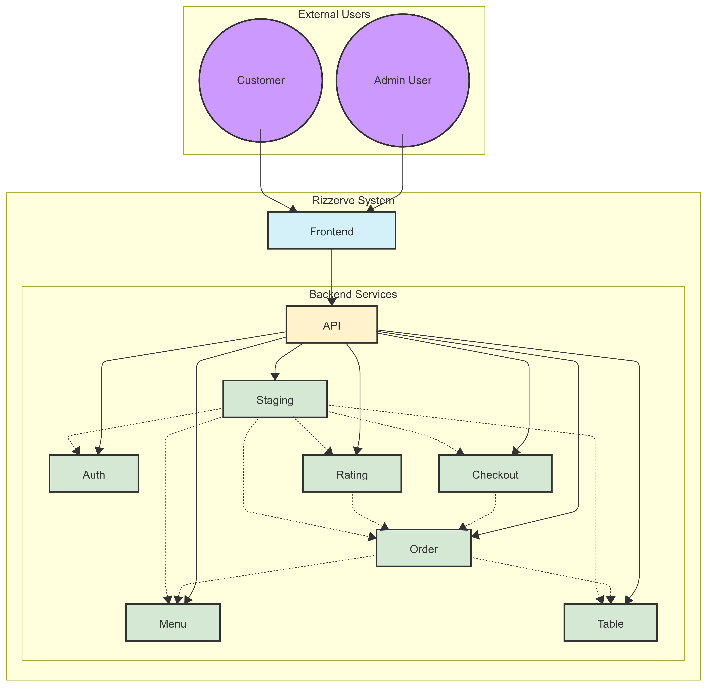
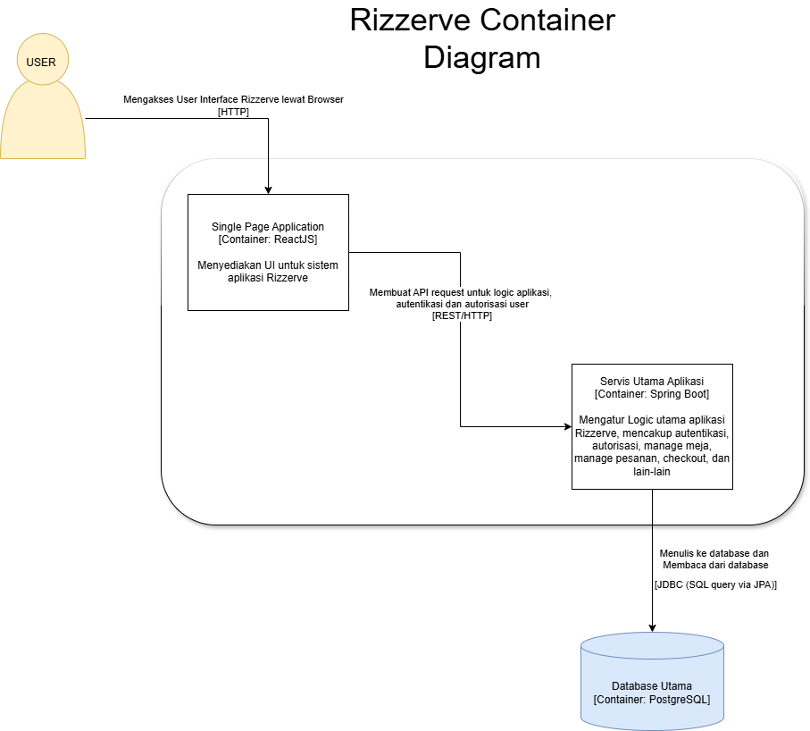
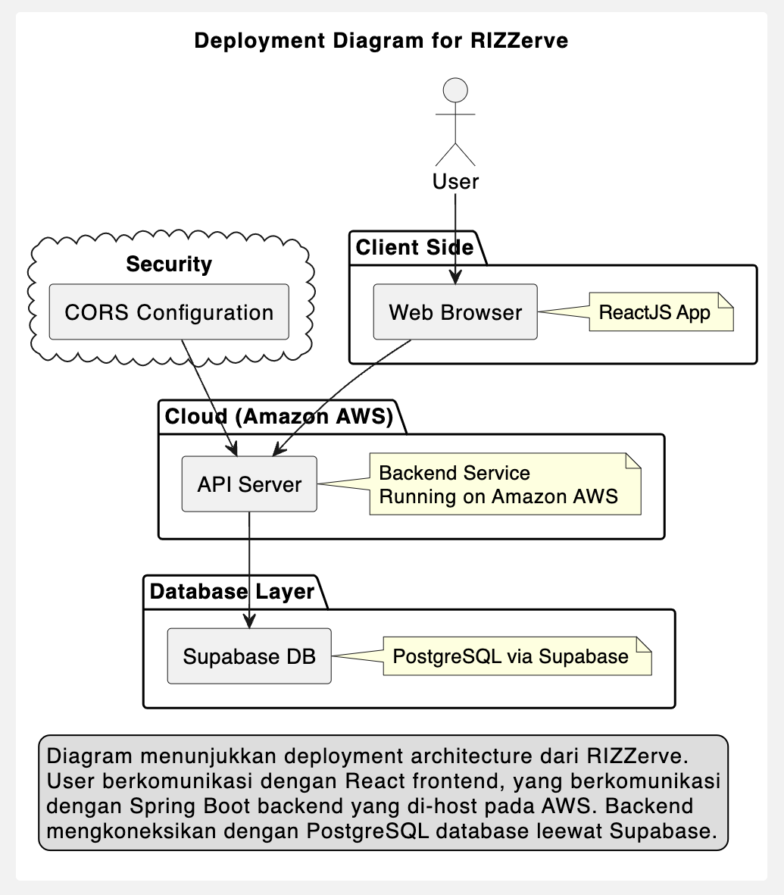
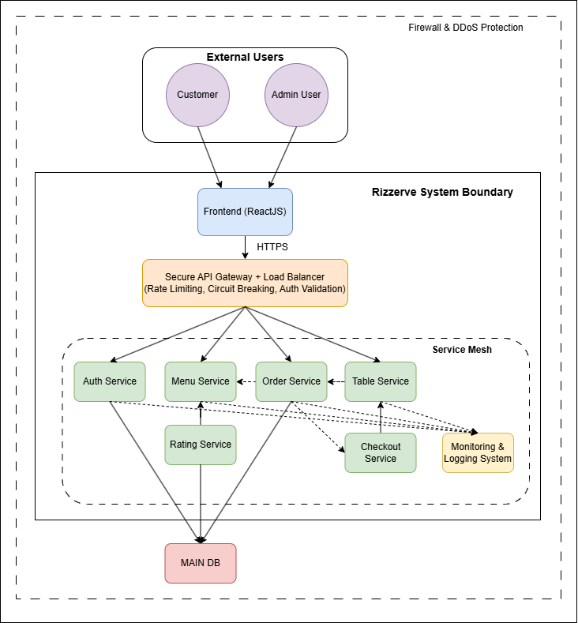
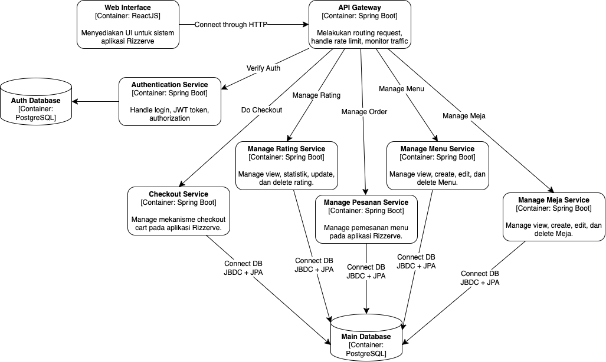
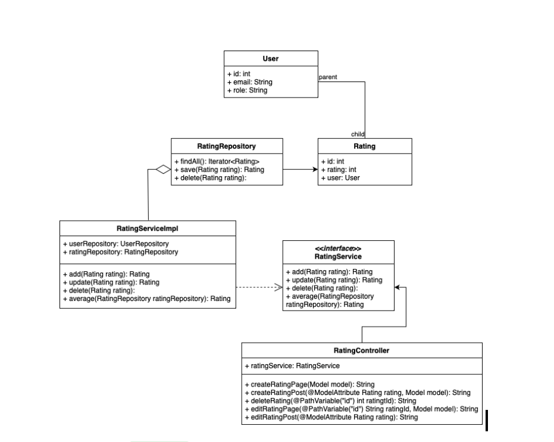
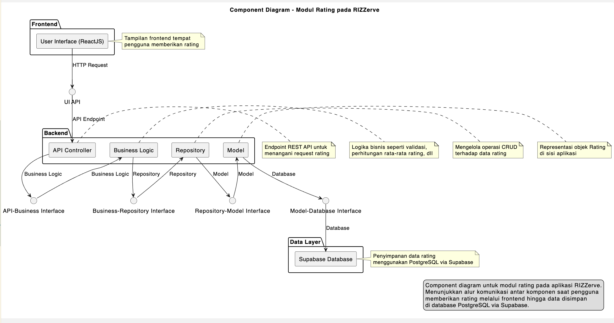
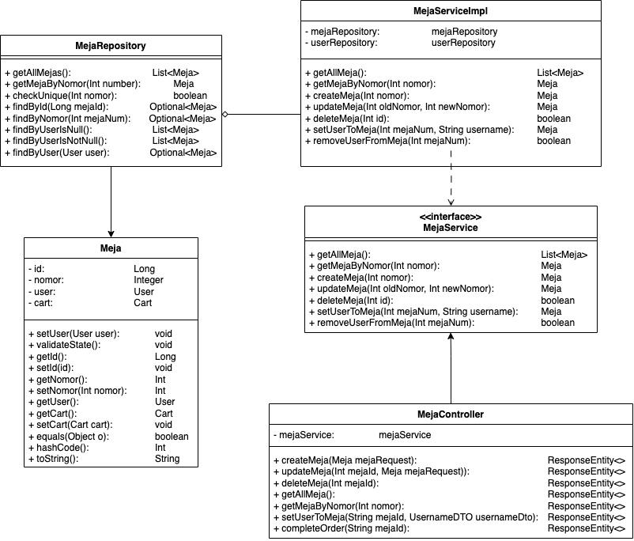
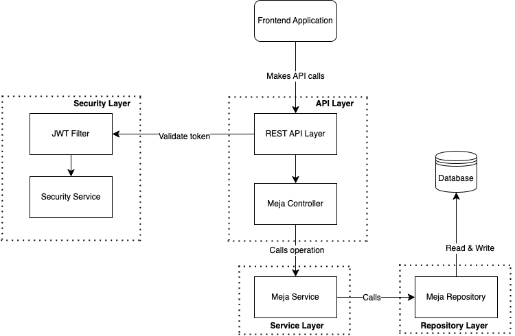

# Tutorial 9 B

## 1. The current architecture of the group Client-Server Architecture , the context, container and deployment diagram

### Context diagram

### Container diagram

### Deployment diagram

## 2. The future architecture of the group microservice-based with API Gateway and separate authentication module.

### Perbaikan Context Diagram

### Perbaikan Container Diagram

## 3. Explanation of risk storming of the group B08

Perbaikan pada context diagram mencakup penambahan API Gateway sebagai komponen sentral dalam arsitektur. API Gateway ini berfungsi untuk menangani load balancing dan menerapkan berbagai kontrol keamanan, seperti rate limiting, circuit breaking, serta validasi autentikasi. Selain itu, struktur microservice juga diperbaiki agar setiap layanan memiliki batasan tanggung jawab (bounded context) yang lebih jelas dan minim ketergantungan antar modul, sehingga mencegah efek domino saat terjadi kegagalan serta meningkatkan scalability. Perubahan ini turut menegaskan pola akses data yang lebih rapi, di mana komunikasi antar layanan dan ke database dilakukan secara terstruktur dan terproteksi melalui protokol HTTPS, yang meningkatkan keamanan komunikasi antar komponen.

Sementara itu, perbaikan pada container diagram menonjolkan pemisahan modul Authentication menjadi layanan terpisah dengan database khusus, sehingga bila terjadi pelanggaran keamanan, dampaknya tidak menjalar ke seluruh sistem. API Gateway juga diperkenalkan sebagai lapisan khusus yang menangani routing permintaan, rate limiting, dan monitoring traffic, yang sebelumnya dilakukan langsung oleh frontend (React) tanpa pengamanan tambahan. Desain arsitektur microservice yang baru mengubah layanan yang awalnya monolitik menjadi beberapa komponen mandiri, seperti Manage Meja, Manage Menu, Manage Pesanan, Rating, dan Checkout. Pendekatan ini memungkinkan setiap layanan untuk di-scale up dan dikembangkan secara independen, sekaligus mengurangi risiko kegagalan menyeluruh dan meningkatkan resiliensi sistem.

Selain itu, desain baru menerapkan koneksi database yang lebih tertata, di mana setiap layanan terhubung ke database-nya sendiri melalui JDBC dan JPA, mendukung isolasi data dan meningkatkan keamanan akses. Dengan arsitektur seperti ini, kami juga lebih mudah menambahkan fitur baru tanpa mengganggu sistem yang sudah berjalan, sehingga risiko regresi dapat diminimalkan dan proses pengembangan lebih efisien. Secara keseluruhan, perbaikan-perbaikan ini dilakukan untuk membangun platform yang lebih aman, scalable, dan sesuai dengan best practices arsitektur modern berbasis microservices.

## 4. Individual component diagram (with its code diagram) of the group B08

### Code diagram (Rating module)

### Component diagram (Rating module)

### Code diagram (Manage Meja module)

### Component diagram (Manage Meja module)
